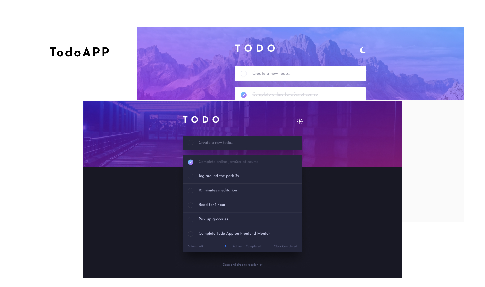

# To do app

A simple to-do list app where you can add tasks, remove them from the list, and keep track of completed and ongoing activities.

## screenshots

## Links

- Live Site URL: [live site](https://tip-calculator-app-sigma-hazel.vercel.app/)
  

## Built 
- Semantic HTML5 markup
- SCSS
- Flexbox
- CSS Grid
- Desktop-first workflow
- Javascript

## Features
- View the optimal layout for the app depending on their device's screen size
- See hover states for all interactive elements on the page
- Add new todos to the list
- Mark todos as complete
- Delete todos from the list
- add new tasks to your to-do list.
- Filter by all/active/complete todos
- Clear all completed todos

## Author
- Twitter - [@itsnooshindev](https://www.twitter.com/itsnooshindev)